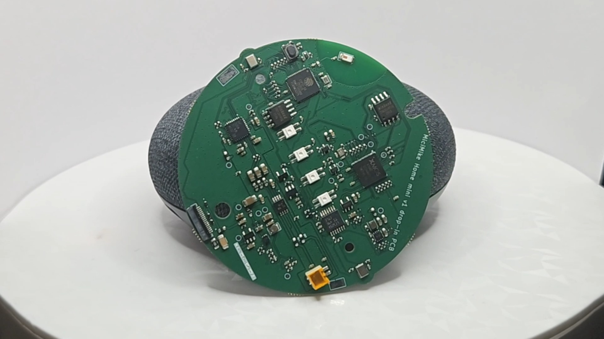

# MiciMike drop-in PCB replacement for Google Home Mini (Gen 1)

[MiciMike Home Mini](https://github.com/iMike78/home-mini-v1-drop-in-pcb) is a drop-in PCB replacement for the original [Google Home Mini](https://en.wikipedia.org/wiki/Google_Nest_(smart_speakers)) with the Micro-USB power connector. It replaces the original electronics with open-source hardware based on an ESP32-S3 and an XMOS xCORE audio processor, and is intended to run ESPHome-based open voice assistant firmware.

The project follows the Home Assistant Voice Preview Edition architecture as closely as the Google Home Mini enclosure allows, while adapting the layout, connectors, controls, microphones, LEDs, and audio path to the original speaker shell.

## Current Status

- Schematic completed
- Component placement completed
- Routing completed
- Ground pour, shielding, and EMI strategy completed
- First prototype batch tested
- Validation batch received and under test
- ESPHome factory provisioning validated with BLE Improv and Home Assistant discovery

## Update: v0.9.5 Touch Controller Migration and Test Points

### Touch Controller Change

The ESP32-S3 built-in touch peripheral has been replaced with an external **MPR121 capacitive touch controller** on the I2C bus at address `0x5A`. This avoids an unresolved ESP-IDF / hardware issue (`IDFGH-16448`) where the touch sensor FSM could lock up and leave all channels stuck at their maximum raw value.

What changed:

- **Hardware:** MPR121 added on the clean `+3V3` rail. Touch pads connect through `ELEC0` to `ELEC2`; IRQ is on `GPIO2`. Unused electrodes are tied together to GND through a single 1 Mohm resistor.
- **Firmware:** the ESPHome `esp32_touch` component was removed and replaced with an `mpr121` hub plus three binary sensors for `volume_down`, `center_button`, and `volume_up`.
- **Freed pins:** ESP32-S3 `GPIO3` and `GPIO4` are no longer used for capacitive touch.

The center touch button is also used as the BLE Improv authorizer in the factory firmware, matching the Home Assistant Voice PE provisioning flow.

### New Solderable Test Points

The board exposes large, easy-to-solder test points for users who do not have the original Google Home Mini daughterboard and FPC connector, or who want to integrate the PCB into a custom enclosure.

- **+5V and GND power input pads:** allow direct power injection without using the original FPC connector.
- **Mute switch pad:** exposes the hardware mute input, which has an on-board pull-up. Pull this pad to GND to power the microphones; otherwise the board remains muted and the microphone path is disabled.

## ESPHome Firmware

The ESPHome configuration lives in [esphome/](./esphome/):

- [micimike-factory.yml](./esphome/micimike-factory.yml) is the manufacturing / first-install firmware. It mirrors the Home Assistant Voice PE factory flow: BLE Improv provisioning, center-button authorization, Home Assistant discovery, and the full voice firmware configuration included underneath.
- [micimike-voice.yml](./esphome/micimike-voice.yml) is the full voice assistant firmware configuration used by the factory build and by normal ESPHome installs.

Typical factory flashing:

```bash
esphome run esphome/micimike-factory.yml
```

After flashing, Home Assistant should discover the device via BLE Improv, ask for Wi-Fi credentials, request center-button authorization, and then add the ESPHome device. The fallback Wi-Fi AP is present, but no captive portal or web server is intentionally enabled.

## Crowdfunding

The crowdfunding campaign is live on Crowd Supply in its pre-order phase. You can subscribe there to show interest and receive email updates:

https://www.crowdsupply.com/micimike-rev-devices/micimike-home-mini-drop-in-pcb



If you are looking for a similar drop-in PCB replacement for the Google Nest Mini, see the sister project:

https://github.com/iMike78/nest-mini-drop-in-pcb

## Project Scope

This repository and its sister project are open-source hardware projects inspired in part by [Onju Voice](https://github.com/justLV/onju-voice), but designed around the open voice assistant hardware direction established by the Open Home Foundation and Home Assistant Voice Preview Edition.

The primary target audience is people who want to repurpose Google Home Mini and Google Nest Mini speakers into open-source Home Assistant voice assistant hardware and/or media player speaker output for [Music Assistant](https://www.music-assistant.io). The hardware may also be useful for other ESP32-based firmware projects.

The design integrates:

- ESP32-S3 for Wi-Fi, BLE, ESPHome, and onboard wake-word detection
- XMOS xCORE XU316 for advanced audio processing
- Local audio cleanup support for noise suppression, acoustic echo cancellation, interference cancellation, and automatic gain control

Functionally, the goal is to stay as compatible as practical with the [Home Assistant Voice Preview Edition](https://www.home-assistant.io/blog/2024/12/19/voice-preview-edition-the-era-of-open-voice/) reference design. The main differences come from the tight mechanical constraints of the Google Home Mini enclosure and original components.

This repository is not intended to become a separate upstream for new ESPHome or XMOS voice features. Feature development should generally happen upstream:

- https://github.com/esphome/home-assistant-voice-pe
- https://github.com/esphome/esphome
- https://github.com/esphome/voice-kit-xmos-firmware

## Collaboration and Contributions

If you would like to support the project, you can buy me a coffee via Ko-fi:

https://ko-fi.com/imike78

Contributions are especially welcome from people with board-level electrical design, KiCad layout, PCB routing, ground-pour strategy, EMI, and mixed-signal audio layout experience. Please open an issue, join an existing discussion, or start a new discussion in this repository.

Background discussion on the Home Assistant community forum:

https://community.home-assistant.io/t/any-news-on-alternative-to-onju-voice-pcb-repacement-design-for-google-nest-home-mini-speakers-with-added-xmos-chip-to-match-official-home-assistant-voice-preview-edition-reference-hardware/860001/

## Tools Used

- KiCad 9
- SnapEDA / LCSC for footprint sourcing

## Known Hardware Specifications

- 4-layer PCB
- ESP32-S3R8 bare chip with 16MB flash
- XMOS XU316-1024-QF60B-C24 xCORE DSP audio processor with 4MB flash
- Dual I2S buses for simultaneous audio input and output
- AIC3204 DAC and TPA6211 power amplifier for speaker output
- 2x T3902 MEMS microphones with 68mm spacing
- 4x SK6812 RGB LEDs
- MPR121 capacitive touch controller

## References

### Home Assistant Voice Preview Edition

- https://www.home-assistant.io/blog/2024/12/19/voice-preview-edition-the-era-of-open-voice/
- https://voice-pe.home-assistant.io/resources/
- https://support.nabucasa.com/hc/en-us/categories/24451727188125-Home-Assistant-Voice-Preview-Edition
- https://github.com/esphome/home-assistant-voice-pe
- https://esphome.github.io/home-assistant-voice-pe/

### XMOS xCORE DSP

- https://www.xmos.com/download/XU316-1024-QF60B-xcore.ai-Datasheet(3).pdf
- https://www.xmos.com/software-tools/
- https://www.xmos.com/develop/xcore-voice
- https://www.xmos.com/usb-multichannel-audio/
- https://www.xmos.com/xcore-ai

### XMOS Firmware

- https://github.com/esphome/voice-kit-xmos-firmware
- https://github.com/esphome/xmos_fwk_rtos
- https://github.com/esphome/xmos_fwk_io

## License

This project is licensed under the [CERN Open Hardware License Version 2 - Strongly Reciprocal (CERN-OHL-S v2)](./LICENCE).

Any modified version of this hardware must also be distributed under the same license.
